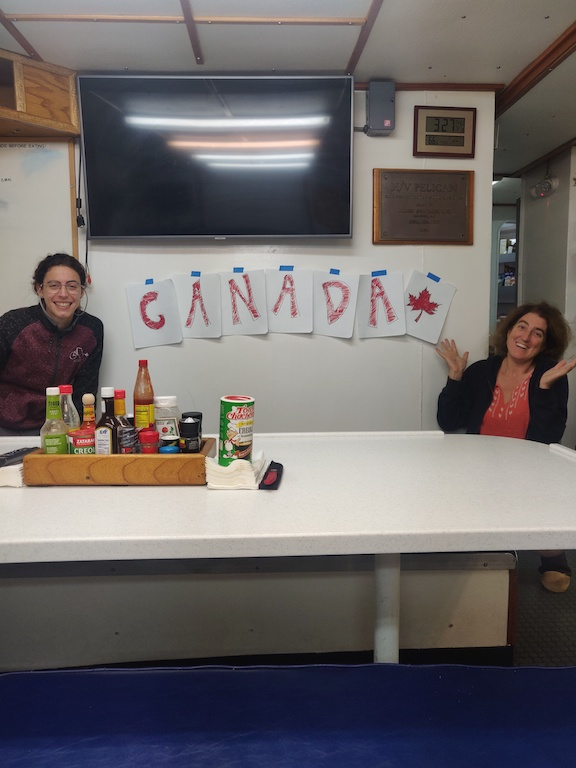

      
 Canada Day: July 1, 2021   
      The crossover from night shift to day shift at 3AM on the 1st of July was marked by an extra special
      event: the singing of the Canadian national anthem. <u> Read More! </u> 
  

      It was an educational experience for those who had never seen nor heard it before, and it was an interesting mix of French, English, and mumbles, as people sang different versions of the song all at once. Happy Canada Day!  

         Andrea and Jen at 3 AM  
        

        -Andrea Rodriguez-Marin Freudmann

