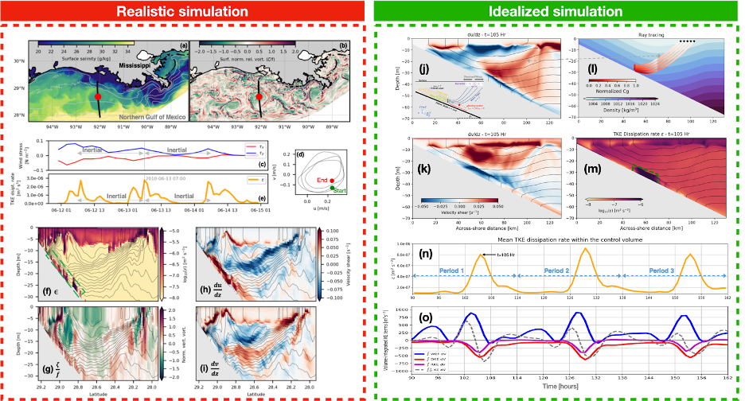

### Assessment of the Gulf Coast Environmental Justice Landscape for Equity (AGEJL-4-EQUITY)
Tyneisha Bradley, Dr. Nathan Morrow, Dr. David Padgett, and Dr. Beverly Wright created a poster for project AGEJL-4-EQUITY. Check it out here!

### Near-inertial wave critical layers
Leif Thomas, Lixin Qu, and Jamie Hilditch have been examining slantwise critical layers over the TXLA shelf, which have been shown to enhance mixing. The figure below demonstrates evidence and processes associated with slantwise critical layers in both the TXLA model and idealized shelf simulations. 

